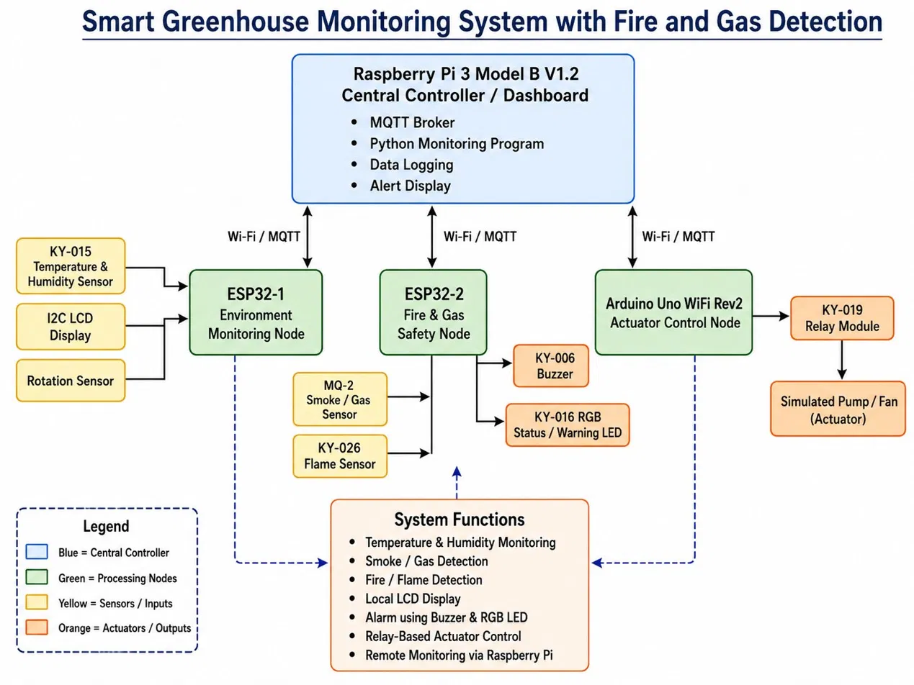

# Smart Greenhouse Monitoring System with Fire and Gas Detection

## Project Overview

The **Smart Greenhouse Monitoring System with Fire and Gas Detection** is an IoT-based embedded system project. It monitors temperature, humidity, smoke/gas, and flame/fire conditions inside a greenhouse. It also provides local warning using a buzzer and RGB LED, and it can simulate actuator control using a relay.

This repository is divided into **one main project folder** and **four member folders**. Each member is responsible for one node of the total IoT greenhouse system.

The updated system uses the hardware that is currently available: **Raspberry Pi 3 Model B V1.2**, **two ESP32 boards**, and **one Arduino Uno WiFi Rev2** as the active actuator node. The Raspberry Pi works as the central controller and MQTT broker. ESP32 boards collect sensor data and handle safety alerts. The Arduino Uno WiFi Rev2 controls the relay output.

Since there is no real pump available now, the relay is used to simulate an actuator with an LED. In a future version, the same relay can control a water pump, fan, or light.

---

## Project Dashboard

> This dashboard is automatically updated by GitHub Actions after every commit.

<!-- AUTO_DASHBOARD_START -->
| Member | Responsible Node | Folder | Commits | Last Activity | Progress |
|---|---|---|---:|---|---|
| Md Mostafizur Rahman | Raspberry Pi 3 — Central Controller | `01_RaspberryPi_Central_Controller_MdMostafizurRahman/` | 9 | 2026-06-10 by Sohan | 100% |
| Turja Barua | ESP32-1 — Environment Monitoring Node | `02_ESP32_Environment_Node_TurjaBarua/` | 3 | 2026-06-04 by Md Mostafizur Rahman | 60% |
| Moaj Chowdhury | ESP32-2 — Fire and Gas Safety Node | `03_ESP32_FireGas_Safety_Node_MoajChowdhury/` | 3 | 2026-06-04 by Md Mostafizur Rahman | 60% |
| Deepak Kapil | Arduino Uno WiFi Rev2 — Actuator / Relay Node | `04_Arduino_Relay_Node_DeepakKapil/` | 3 | 2026-06-04 by Md Mostafizur Rahman | 60% |
<!-- AUTO_DASHBOARD_END -->

---
## Block Diagram



---

## Available Hardware Components

| No. | Component | Quantity / Note |
|---:|---|---|
| 1 | Raspberry Pi 3 Model B V1.2 | 1 |
| 2 | ESP32 microcontroller | 2 |
| 3 | Arduino Uno WiFi Rev2 microcontroller | 1 |
| 4 | MQ-2 smoke/gas sensor | 1 |
| 5 | KY-026 analog flame sensor | 1 |
| 6 | KY-019 5V relay module | 1 |
| 7 | I2C LCD display | 1 |
| 8 | KY-016 RGB 5 mm LED | 1 |
| 9 | Jumper wires and breadboard | Available |
| 10 | KY-006 passive piezo buzzer | 1 |
| 11 | KY-051 voltage translator / level shifter | 1 |
| 12 | KY-015 temperature and humidity sensor | 1 |
| 13 | Rotation sensor | 1 |
| 14 | Micro SD card | 1 |

---

## System Architecture

The system is divided into one central controller and three main working nodes.

### 1. Raspberry Pi 3 Model B V1.2 — Central Controller / Dashboard

**Assigned to:** Md Mostafizur Rahman  
**Folder:** `01_RaspberryPi_Central_Controller_MdMostafizurRahman/`

Main tasks:

- Run MQTT broker.
- Receive sensor data from ESP32 and Arduino nodes.
- Store or print sensor data.
- Show dashboard or terminal status.
- Send commands to actuator node if needed.

The Raspberry Pi is the main communication and monitoring unit of the project.

### 2. ESP32-1 — Environment Monitoring Node

**Assigned to:** Turja Barua  
**Folder:** `02_ESP32_Environment_Node_TurjaBarua/`

Connected components:

- KY-015 temperature and humidity sensor.
- I2C LCD display.
- Rotation sensor.

Main tasks:

- Read temperature and humidity.
- Show values on the LCD display.
- Send data to the Raspberry Pi using Wi-Fi/MQTT.
- Use the rotation sensor as a manual input, for example to set an alarm threshold.

### 3. ESP32-2 — Fire and Gas Safety Node

**Assigned to:** Moaj Chowdhury  
**Folder:** `03_ESP32_FireGas_Safety_Node_MoajChowdhury/`

Connected components:

- MQ-2 smoke/gas sensor.
- KY-026 analog flame sensor.
- KY-006 passive piezo buzzer.
- KY-016 RGB LED.

Main tasks:

- Detect smoke or gas.
- Detect flame/fire.
- Turn on the buzzer during danger.
- Change RGB LED color based on system status.
- Send alert messages to the Raspberry Pi using Wi-Fi/MQTT.

Example RGB LED status:

| Condition | RGB LED Status | Buzzer |
|---|---|---|
| Normal condition | Green | OFF |
| Warning condition | Yellow / Blue | Optional warning |
| Fire, flame, smoke, or gas danger | Red | ON |

### 4. Arduino Uno WiFi Rev2 — Actuator / Relay Control Node

**Assigned to:** Deepak Kapil  
**Folder:** `04_Arduino_Relay_Node_DeepakKapil/`

Connected components:

- KY-019 5V relay module.
- Optional LED output for actuator simulation.

Main tasks:

- Receive command from Raspberry Pi or ESP32.
- Turn relay ON or OFF.
- Simulate water pump, fan, or light control.

At the current stage, the relay output is used to simulate an actuator using an LED. In a future version, the relay can control a real water pump or fan.

---

## Team Task Division

### 1. Md Mostafizur Rahman — Raspberry Pi 3 Central Controller

Folder: `01_RaspberryPi_Central_Controller_MdMostafizurRahman/`

Main tasks:

- Install and configure MQTT broker on Raspberry Pi 3.
- Create Python monitoring program.
- Receive MQTT data from ESP32 and Arduino nodes.
- Print or store sensor data.
- Show dashboard or terminal status.
- Send actuator commands to Arduino relay node.

Expected output:

- MQTT broker running on Raspberry Pi.
- Python dashboard or terminal monitor.
- Logs of temperature, humidity, gas, flame, and relay status.

### 2. Turja Barua — ESP32-1 Environment Monitoring Node

Folder: `02_ESP32_Environment_Node_TurjaBarua/`

Main tasks:

- Connect KY-015 temperature and humidity sensor.
- Connect I2C LCD display.
- Connect rotation sensor as manual threshold input.
- Read temperature and humidity values.
- Show values locally on LCD.
- Send environment data to Raspberry Pi using MQTT.

Expected output:

- Temperature and humidity readings.
- LCD display output.
- MQTT messages to Raspberry Pi.

### 3. Moaj Chowdhury — ESP32-2 Fire and Gas Safety Node

Folder: `03_ESP32_FireGas_Safety_Node_MoajChowdhury/`

Main tasks:

- Connect MQ-2 smoke/gas sensor.
- Connect KY-026 analog flame sensor.
- Connect KY-006 passive buzzer.
- Connect KY-016 RGB LED.
- Detect gas/smoke and flame/fire.
- Turn on buzzer and warning LED during danger.
- Send alert data to Raspberry Pi using MQTT.

Expected output:

- Gas/smoke detection status.
- Flame/fire detection status.
- Local buzzer and RGB LED warning.
- MQTT alert messages.

### 4. Deepak Kapil — Arduino Uno WiFi Rev2 Actuator / Relay Node

Folder: `04_Arduino_Relay_Node_DeepakKapil/`

Main tasks:

- Connect KY-019 relay module.
- Use relay to simulate actuator control with an LED.
- Receive ON/OFF command from Raspberry Pi using Wi-Fi/MQTT.
- Switch relay ON/OFF.
- In future version, replace LED simulation with water pump, fan, or light.

Expected output:

- Relay ON/OFF control.
- Actuator simulation using LED.
- MQTT command reception.

---

## Repository Folder Structure

```text
Smart_Greenhouse_Team_Project/
├── README.md
├── docs/
│   └── system_overview.md
├── scripts/
│   └── update_dashboard.py
├── .github/
│   └── workflows/
│       └── update-dashboard.yml
├── 01_RaspberryPi_Central_Controller_MdMostafizurRahman/
│   ├── README.md
│   ├── src/
│   ├── logs/
│   └── docs/
├── 02_ESP32_Environment_Node_TurjaBarua/
│   ├── README.md
│   ├── src/
│   └── docs/
├── 03_ESP32_FireGas_Safety_Node_MoajChowdhury/
│   ├── README.md
│   ├── src/
│   └── docs/
└── 04_Arduino_Relay_Node_DeepakKapil/
    ├── README.md
    ├── src/
    └── docs/
```

---

## Communication Method

The system uses **Wi-Fi and MQTT** for communication between the nodes.

- The Raspberry Pi 3 runs the MQTT broker.
- ESP32-1 publishes environment data.
- ESP32-2 publishes fire, smoke, gas, and alarm data.
- Arduino Uno WiFi Rev2 subscribes to relay commands and publishes relay status.

---

## MQTT Topic Plan

| Topic | Direction | Purpose |
|---|---|---|
| `greenhouse/env/temperature` | ESP32-1 → Raspberry Pi | Temperature value |
| `greenhouse/env/humidity` | ESP32-1 → Raspberry Pi | Humidity value |
| `greenhouse/env/threshold` | ESP32-1 → Raspberry Pi | Manual threshold from rotation sensor |
| `greenhouse/safety/smoke` | ESP32-2 → Raspberry Pi | MQ-2 smoke/gas analog value |
| `greenhouse/safety/flame` | ESP32-2 → Raspberry Pi | Flame sensor status/value |
| `greenhouse/safety/status` | ESP32-2 → Raspberry Pi | Safety status text |
| `greenhouse/safety/alarm` | ESP32-2 → Raspberry Pi | Alarm state |
| `greenhouse/actuator/relay/set` | Raspberry Pi → Arduino | Relay ON/OFF command |
| `greenhouse/actuator/relay/status` | Arduino → Raspberry Pi | Relay feedback status |

---

## Working Principle

1. ESP32-1 reads temperature and humidity using the KY-015 sensor.
2. ESP32-1 displays the values on the I2C LCD.
3. The rotation sensor can be used to change a threshold value manually.
4. ESP32-1 sends environment data to the Raspberry Pi through MQTT.
5. ESP32-2 reads the MQ-2 gas sensor and KY-026 flame sensor.
6. If smoke, gas, or flame is detected, ESP32-2 activates the buzzer and RGB LED.
7. ESP32-2 sends an alert message to the Raspberry Pi.
8. The Raspberry Pi shows the received values and alert status.
9. The Raspberry Pi can send an ON/OFF command to the Arduino relay node.
10. The Arduino Uno WiFi Rev2 switches the relay ON/OFF to simulate an actuator.

---

## Main Features

- Temperature and humidity monitoring.
- Smoke/gas detection.
- Flame/fire detection.
- Local LCD display.
- Alarm using buzzer and RGB LED.
- Relay-based actuator simulation.
- Wireless communication using Wi-Fi/MQTT.
- Raspberry Pi dashboard or monitoring terminal.
- Automatic README dashboard update using GitHub Actions.
- Separate folder ownership for each team member.

---

## System Function Table

| Node | Hardware | Input Components | Output Components | Main Function |
|---|---|---|---|---|
| Central Controller | Raspberry Pi 3 Model B V1.2 | MQTT messages | Dashboard / terminal / commands | Monitoring, logging, and control |
| Environment Node | ESP32-1 | KY-015 sensor, rotation sensor | I2C LCD, MQTT data | Temperature and humidity monitoring |
| Safety Node | ESP32-2 | MQ-2 sensor, KY-026 sensor | Buzzer, RGB LED, MQTT alert | Fire, smoke, and gas detection |
| Actuator Node | Arduino Uno WiFi Rev2 | MQTT command | Relay, optional LED | Simulated pump/fan/light control |

---

## Overall Project Checklist

- [ ] Raspberry Pi MQTT broker installed and running.
- [ ] Raspberry Pi monitoring program receives all MQTT topics.
- [ ] Sensor data is printed or logged with timestamps.
- [ ] ESP32-1 reads KY-015 temperature and humidity values.
- [ ] ESP32-1 displays values on I2C LCD.
- [ ] ESP32-1 publishes threshold value from rotation sensor.
- [ ] ESP32-2 reads MQ-2 smoke/gas values.
- [ ] ESP32-2 detects flame/fire using KY-026.
- [ ] ESP32-2 activates buzzer and RGB LED during danger.
- [ ] Arduino receives relay command using MQTT.
- [ ] Arduino switches relay ON/OFF and simulates actuator using LED.
- [ ] End-to-end MQTT communication tested between all nodes.
- [ ] GitHub README dashboard updates automatically after commits.

---

## How the Dashboard Auto-Sync Works

1. A member commits changes inside their own folder.
2. GitHub Actions runs `.github/workflows/update-dashboard.yml`.
3. The workflow runs `scripts/update_dashboard.py`.
4. The script checks Git commit history for each folder.
5. The table between `AUTO_DASHBOARD_START` and `AUTO_DASHBOARD_END` is updated.
6. The updated README is committed automatically.

---


## Commit Message Convention

Use the folder name in every commit message so the dashboard can track member progress correctly.

```text
01_RaspberryPi_Central_Controller_MdMostafizurRahman: add MQTT broker setup
02_ESP32_Environment_Node_TurjaBarua: add KY-015 sensor reading
03_ESP32_FireGas_Safety_Node_MoajChowdhury: add MQ-2 smoke threshold
04_Arduino_Relay_Node_DeepakKapil: add relay ON OFF command
README: update system overview
```

---

## Future Improvements

- Add a real water pump or fan.
- Add soil moisture sensor.
- Add camera monitoring.
- Add web dashboard.
- Add database storage.
- Add mobile notification.
- Add automatic control rules for temperature, humidity, and safety alerts.
- Add remote access through a web dashboard.

---

## Conclusion

This updated project is realistic with the currently available hardware. It includes environmental monitoring, fire and gas safety detection, local alert output, relay-based actuator simulation, and wireless MQTT communication. The repository structure also supports team-based development because each member has a separate folder and the main README dashboard can show commit activity and progress automatically.

Therefore, this project is suitable for an embedded systems or IoT-based lab project.
